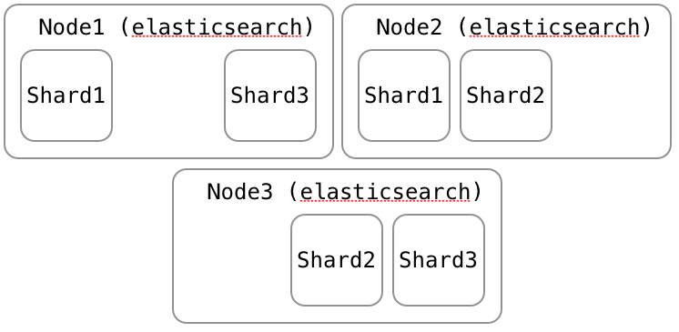
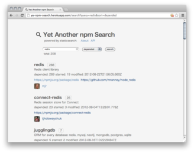

# Fulltext search with Node.js and elasticsearch

2012 11/18 tokyo nodefest 2012 @swdyh

# swdyh (twitter / github / tumblr)

* ブラウザ拡張開発
  * AutoPagerize
    * ページの自動継ぎ足し
    * [http://autopagerize.net](http://autopagerize.net)
* JavaScriptやRuby、Goに興味

# Fulltext search

* システム開発に検索はつきもの
* 小規模なら全件走査 LIKE '%query%'
* それで間に合わなくなってくると全文検索エンジン
  * あらかじめindexを作る。本の最後にあるindex
* Namazu, Hyper Estraier, Senna, Tritonn, Groonga, Sphinx, Lucene, Solr, elasticsearch

  
# elasticsearch
[http://www.elasticsearch.org](http://www.elasticsearch.org)

* Open Souce
* Apache Lucene
* シンプルなRESTful API
* 分散検索
* ドキュメントストア (MongoDB, CouchDB)
* さまざまな言語に対応、日本語も大丈夫

# Solrとの違い

* Solrを知らないので分からない…
   * Apache Solr vs ElasticSearch [http://solr-vs-elasticsearch.com/](http://solr-vs-elasticsearch.com/)
* どちらも開発が活発
  * 機能差はなくなる傾向
* elasticsearchは開発者の使いやすさや管理しやすさを重視
  * APIがシンプル
  * クラスタリングの手間を少なく

# elasticsearch.com

* [http://www.elasticsearch.com](http://www.elasticsearch.com)
* 会社設立
* 資金調達して順調
  * "ビッグデータをリアルタイムで（アドホックで）検索〜分析するElasticsearchが$10Mを調達"
    * [http://jp.techcrunch.com/archives/20121108big-data-search-and-analytics-startup-elasticsearch-has-raises-10m-from-benchmark/](http://jp.techcrunch.com/archives/20121108big-data-search-and-analytics-startup-elasticsearch-has-raises-10m-from-benchmark/)

# 利用事例

* Mozilla Foundation, StumbleUpon, Sony Computer Entertainment, Infochimps, Assistly, Ataxo Social Insider, Bazzarvoice, Klout, Sonian Inc., IGN, InSTEDD
  * [http://www.elasticsearch.org/users](http://www.elasticsearch.org/users)
* Sound Cloud
  * [http://backstage.soundcloud.com/2012/08/evolution-of-soundclouds-architecture/](http://backstage.soundcloud.com/2012/08/evolution-of-soundclouds-architecture/)

# RESTful API 01

* HTTP (GET / POST / PUT / DELETE)
* JSON (request / response)

# RESTful API 02

    % curl -X PUT localhost:9200/demo-index
    % curl -X PUT localhost:9200/demo-index/x/1 -d '
        {"text": "hello world" }'
    % curl localhost:9200/demo-index/x/_search -d '
        { "query": { "text": { "text": "hello" } } }'

# RESTful API 03

http://localhost:9200/index/type/document_id

* index: RDBMSでいうデータベース
* type: RDBMSでいうテーブル、type内のドキュメントは同じmapping(スキーマ定義)が適用される
* document: JSONデータ

# DocumentStore

* Document Oriented(MongoDB, CouchDB)
* JSON(object, array, string, number, boolean, null)
* date, geo_point, geo_shape, ip, binary(base64), attachment(base64)
* 検索エンジン側にデータがあると、条件付き検索やソートがしやすい

# Quereis & Filters

* Queries: match, multi_match, bool, boosting, ids, custom_score, custom_boost_factor, constant_score, dis_max, field, filtered, flt, flt_field, fuzzy, has_child, has_parent, match_all, mlt, mlt_field, prefix, query_string, range, span_first, span_near, span_not, span_or, span_term, term, terms, top_children, wildcard, nested, custom_filters_score, indices, text, geo_shape
* Filters: and, bool, exists, ids, limit, type, geo_bbox, geo_distance, geo_distance_range, geo_polygon, geo_shape, has_child, has_parent, match_all, missing, not, numeric_range, or, prefix, query, range, script, term, terms, nested

# 日本語対応

文章に区切りがないのでそれをなんとかする必要がある

* 分かち書き: 今日 | は | 天気 | が | いい
* Ngram (2 gram): 今日 | 日は | は天 | 気が | がい | いい

# 分かち書きを使う

* kuromoji plugin [https://github.com/elasticsearch/elasticsearch-analysis-kuromoji](https://github.com/elasticsearch/elasticsearch-analysis-kuromoji)
* mappingsでanalyzerにkuromojiを指定

    bin/plugin -install elasticsearch/elasticsearch -analysis-kuromoji/1.0.0

 
# Ngramを使う

* nGgram Analyzer, nGram Tokenizer
* デフォルトの設定が 1 - 3 gram
  * 1 gramはヒットし過ぎる
* "ElasticSearch でいろんなデータに自由に全文検索インデックスを張る"
  * [http://give-me-money.g.hatena.ne.jp/fuba/20120909/1347204261](http://give-me-money.g.hatena.ne.jp/fuba/20120909/1347204261)
  * nGram Tokenizerの設定を2-3 gramに

# Cluster 01

* elasticsearchを起動したサーバを用意
* それらを見つけられるようにする
  * 見つける方法
     * サーバ名を設定ファイルに書く
     * multicastで近くのネットワークを探す
     * aws-cloud plugin: AWSのユーザkeyとsecretからec2インスタンスを取得、elasticserachがそこから動いてるサーバを見つける

 
# Cluster 02

* node: elasticsearchインスタンス、ふつう1サーバ
* shard: 分割されたデータを持つ、Luceneインスタンス
* replica: shardの複製、フェイルオーバーとパフォーマンス

# Cluster 03

3 shards 1 replica: 1 nodeの場合、replicaはできない

# Cluster 04

3 shards 1 replica: nodeを追加、replicaが作成される

# Cluster 05

3 shards 1 replica: さらにnodeを追加、shardがリバランスされる

# Cluster 06

3 shards 1 replica: node3が落ちると、2nodeのときのようになる

# Cluster 07

* Three Nodes and One Cluster (デモ動画) [http://www.elasticsearch.org/videos/2012/06/05/three-nodes-and-one-cluster.html](http://www.elasticsearch.org/videos/2012/06/05/three-nodes-and-one-cluster.html)

# Routing 01

* どのshardに保存するか、どのshardから検索するか
* routingパラメータでキーを指定する
* 同じキーなら同じshard

# Routing 02

    curl -X PUT localhost:9200/demo-index\
         /x/1?routing=201211 -d ...
    curl localhost:9200/demo-index\
        /x/_search?routing=201211 -d ...

# Routing 03

* ふつうの検索は全てのshardを検索して結果を集めて返すが、routingを指定した場合はそのデータがあるshardだけを検索するので効率がいい
* ユーザidで、ログを年月で、など。デフォルトはドキュメントのid

# Routing 03

# Routing 04

# Node.jsから使う
 
* elasticsearch用モジュール(elastical, elasticsearchclient, es...)
* http client
  * 標準のhttpクライアント
  * request (おすすめ、JSONが扱いやすい)

# index作成 01

    var request = require('request')
    request.put({
        uri: 'http://localhost:9200/demo-index',
        json: true
    }, function(err, res, val) {
        console.log(err, val)
    })

# index作成 02 (mappings: schema)

    request.put({
        uri: 'http://localhost:9200/demo-index',
        json: { mappings: { demo: {
            properties: { text: { type: 'string',
                                  analyzer: 'kuromoji' } } } } }
    }, function(err, res, val) {
        console.log(err, val)
    })

# データ追加(put)

    request.put({
        uri: 'http://localhost:9200/demo-index/demo/1',
        json: { text: 'こんにちは世界' }
    }, function(err, res, val) {
        console.log(err, val)
    })

# データ追加(post)

    // idが自動で付加される
    request.post({
        uri: 'http://localhost:9200/demo-index/demo',
        json: { text: 'こんにちは世界' }
    }, function(err, res, val) {
        console.log(err, val)
    })

# 検索

    request({
        uri: 'http://localhost:9200/demo-index/demo/_search',
        json: {
             query: { text: { text: '世界' } }
        }
    }, function(err, res, val) {
        console.log(err, val)
    })

# live coding

* elasticsearchはlocalhostで起動済み(localhost:9200)
* 約200件のtweets(tweets.json)をelasticsearchに入れて検索する
* 簡単なmappingを用意済(mappings.json)
  * indexの作成
  * データの追加
  * 検索
  * ExpressでかんたんなWeb UI

# ya-npm-search 01

elasticsearchとNode.jsでつくったnpm検索  
[http://ya-npm-search.herokuapp.com/](http://ya-npm-search.herokuapp.com/)

# ya-npm-search 02

* npm search
  * 全データを同期してシーケンシャルな文字列マッチ、遅い
  * どれを選べばいいのか分からない
* elasticearchで検索、expressでWeb UI、CLI
* githubのスター数、フォーク数を属性に追加
* npmの依存数、スター数
* herokuとbonsai elasticsearch addonで運用

<!--
# bonsai elasticsearch 01

* [http://bonsai.io/](http://bonsai.io/)
* heroku addon (public beta)
* インストールや設定が不要。
* addonを追加するとindexのurlがもらえてすぐ使える
* public beta
  * テストプランのみ、開発やテスト向け、無料

# bonsai elasticsearch 02

* バックアップが取りにくい
  * ファイル自体にアクセスできない
  * scroll機能が使えない
  * gatewayも使えない
* 認証がゆるい
  * urlが秘密、 urlが漏れると読み書きされてしまう
* 運用に不安
  * トラブル。自分のところは全データ消失があった。
-->
