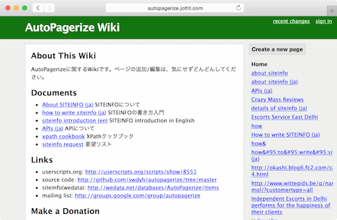

% Slide Show Headers

title: Remember Jottit
author: @swdyh
cover: a.001.jpeg

% Slides Start Here

# 自己紹介
* swdyh
  * AutoPagerize(ページを継ぎ足すブラウザ拡張)
  * wedata.net (文書ではなくてデータを共同編集するWiki、江渡浩一郎さんとのプロジェクト)
  * トレタ社(PukiWikiのひとがCTO) サーバサイドエンジニア

# 今日のはなし
Aaron Swartzっていうひとがいて、JottitっていうシンプルでかっこいいWikiサービスをつくってた

# ところで
* AaronSwartz？
* Jottit？

# Aaron Swartz

# Aaron Swartz
* RSSとかCreative Commonsの仕様策定に関わる(14歳とかのころ)
* Reddit共同経営者
* Markdown(john gruber)に協力
* インターネット活動家
* MIT内からしかアクセスできない論文を大量にダウンロード、publicにしようとして捕まる
* ↑の件で、有罪になりそう。自殺(2013 26歳)
* [Wikipedia アーロン・スワーツ](https://ja.wikipedia.org/wiki/%E3%82%A2%E3%83%BC%E3%83%AD%E3%83%B3%E3%83%BB%E3%82%B9%E3%83%AF%E3%83%BC%E3%83%84)

# Aaron Swartz
* Python Hacker
* web.py作者 (軽量Webアプリケーションフレームワーク)
  * web.py 2006/01
  * Camping 2006/01(why the lucky stiff)
  * Sinatra 2007/09
* Infogami (wiki)
* Jottit (wiki)

# Jottit
  
www.jottit.com 2007/09 (Simon Carstensen and Aaron Swartz)

# Jottit
  

# Jottit
* 手軽でシンプル
  * トップページはテキストエリアだけ
  * 書き込むとWikiができる
* Markdown、リアルタイムプレビュー
* ユーザ登録不要 (サイトをつくるのも、編集するのも)
* プライベートなWikiはパスワードで

# 評判
> Aaron Swartzの新しいプロジェクト Jottit。 機能はごく単純なwiki (というかwikifarm) なんだけど、インタフェースが秀逸。 less is moreの精神。
  
shiro [http://blog.practical-scheme.net/shiro/20070915b-jottit](http://blog.practical-scheme.net/shiro/20070915b-jottit)

# 評判
> 匿名でページ作成、編集ができるwiki サービスって意外と無いような気がするので、存続してほしいですね

youpy
 
# 残念ながら
* 開発とまっている。サービスもよく止まっている
* 今日も動いてない (スクリーンショットとか撮れなくて困った)
* 終わりゆくサービス
* いまの新しいWiki開発ブームに期待
* Aaron Swartzの精神を受け継ぎつつ、参戦、もしくはコントリビュートしたい